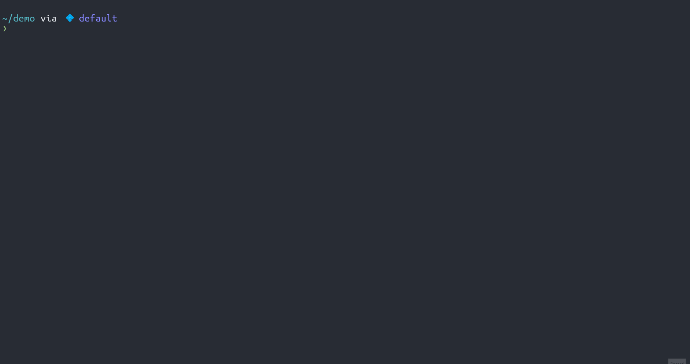

# pipeform

## Introduction

`pipeform` is a TUI for Terraform runtime progress.

## Usage

`pipeform` as its name indicates, shall be preceded by `terraform` run, through a pipe (`|`). Only the following `terraform` commands are supported:

- `terraform refresh -json`
- `terraform plan -json`
- `terraform apply -auto-approve -json`

Note that all the commands must have the `-json` flag specified, as the tool is built on top of the [Terraform machine-readable UI](https://developer.hashicorp.com/terraform/internals/machine-readable-ui).

Example:



## Install

```shell
go install github.com/magodo/pipeform@main
```

## Timing CSV File

The tool will generate a CSV file for further analysis/visualization by specifying the `--time-csv=<path>` option.

A taste of the output:

```csv
Start Timestamp,End Timestamp,Stage,Action,Module,Resource Type,Resource Name,Resource Key,Status,Duration (sec)
1735018449,1735018453,apply,create,,null_resource,cluster,13,complete,4
1735018449,1735018453,apply,create,,null_resource,cluster,3,complete,4
1735018449,1735018451,apply,create,,null_resource,cluster,1,complete,2
1735018450,1735018451,apply,create,,null_resource,cluster,25,complete,1
1735018450,1735018452,apply,create,,null_resource,cluster,26,complete,2
```

## FAQ

### How to copy output variables?

In a successful run, the tool will end up at the `SUMMARY` stage, that displays a table of output variables defined. Users can select any of the output variables and press <kbd>c</kbd> to copy the value to the system clipboard.

Note that the clipboard functionality is only enabled when the tool is built properly (CGO might be required) on a supported platform. [Details](https://github.com/golang-design/clipboard?tab=readme-ov-file#platform-specific-details).

### What happens if terraform encounters an error?

When Terraform encounters error(s), the tool will display an error indicator ❌ in the "state" section on the top left and stay in a terminated state. In this case, the user is supposed to quit. Afterwards, the Terraform JSON error diagnostics will be displayed to `stderr`.

### How to exit during operation?

There are two ways to exit during operation:
- Terminate `pipeform`
- Terminate `terraform`

Though, it is highly recommended **NOT** to terminate in the middle of the run.

#### Terminate `pipeform`

There is a key bind for terminating `pipeform`. When the user hit the key to quit, `pipeform` will quit immediately, which causes the pipe to close. Since `terraform` is still running and piping out logs, it will then hit a `SIGPIPE` signal, which `terraform` has no special handling and defaults to terminate `terraform` immediately.

#### Terminate `terraform`

Terraform can be terminated by interruption (<kbd>ctrl-c</kbd>). It even has *some* graceful handling for the interruption signal.

Whilst when using `pipeform`, since the terminal is turned into *raw* mode, pressing <kbd>ctrl-c</kbd> won't send the signal at all. Instead, you'll have to send the signal manually.

Under Linux you can do something as below:

```
$ # Find out the ppid of the `pipeform`
$ ps -ef | grep pipeform
magodo     88375    8823  1 11:05 pts/7    00:00:00 pipeform
magodo     89764   49424  0 11:05 pts/6    00:00:00 grep --color pipeform
$ # 8823 is the ppid of `pipeform`
$ # Use pstree to find the pid of the preceded `terraform`
$ pstree -lpT 8823
zsh(8823)─┬─pipeform(88375)
          └─terraform(88374)───terraform-provi(88695)
$ # 88374 is the pid of `terraform`
$ # Send the signal manully
$ kill -SIGINT 88374
```

After `terraform` being interrupted in the middle, `pipeform` won't just quit. Instead, it will respond to the diagnostics sent from `terraform` (once `terraform` finishes its *graceful* handling) and display the error indicators to users.
